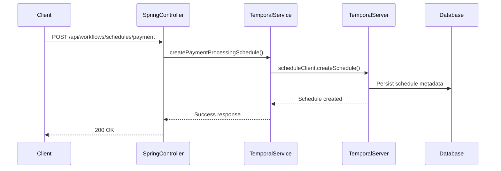
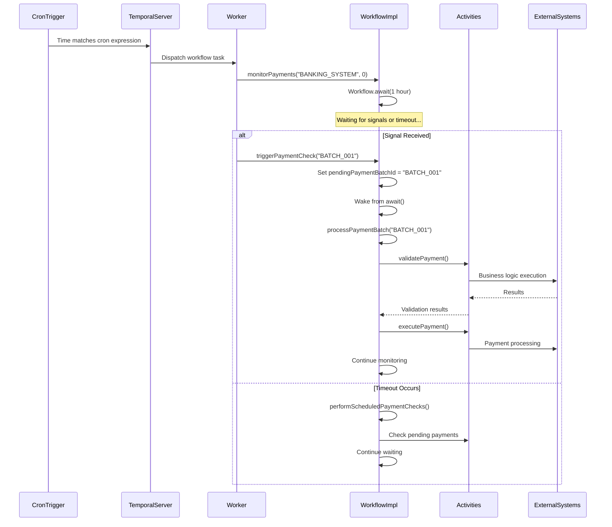
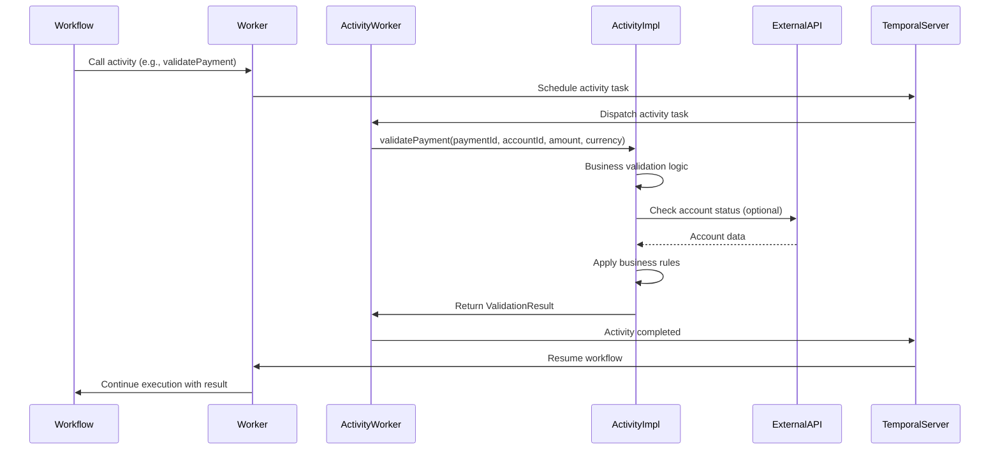
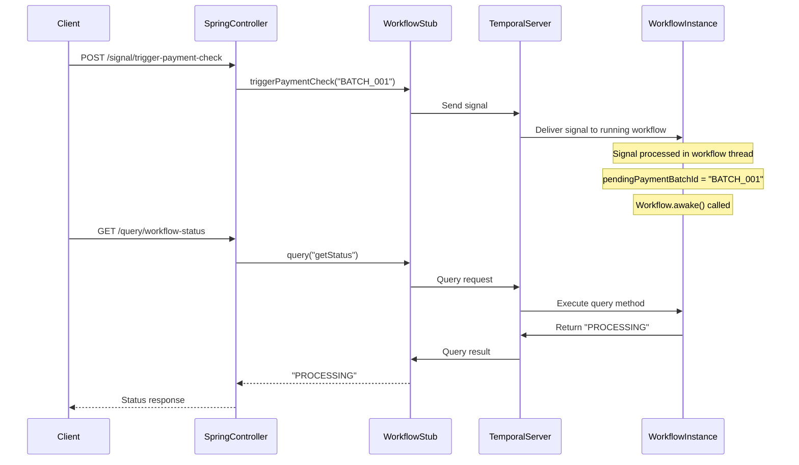
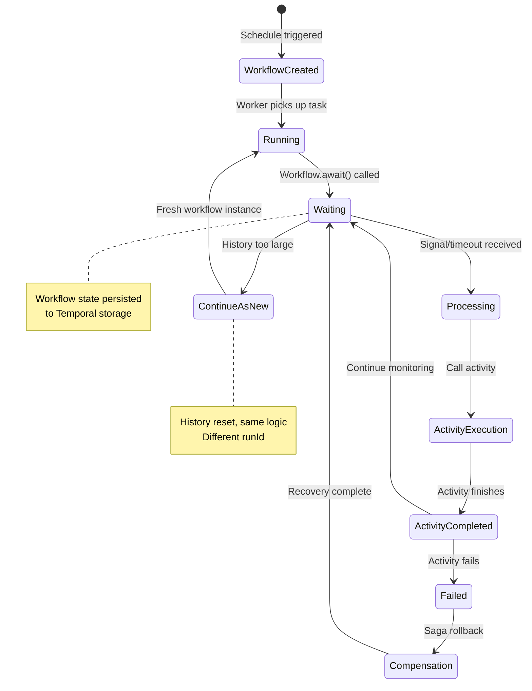
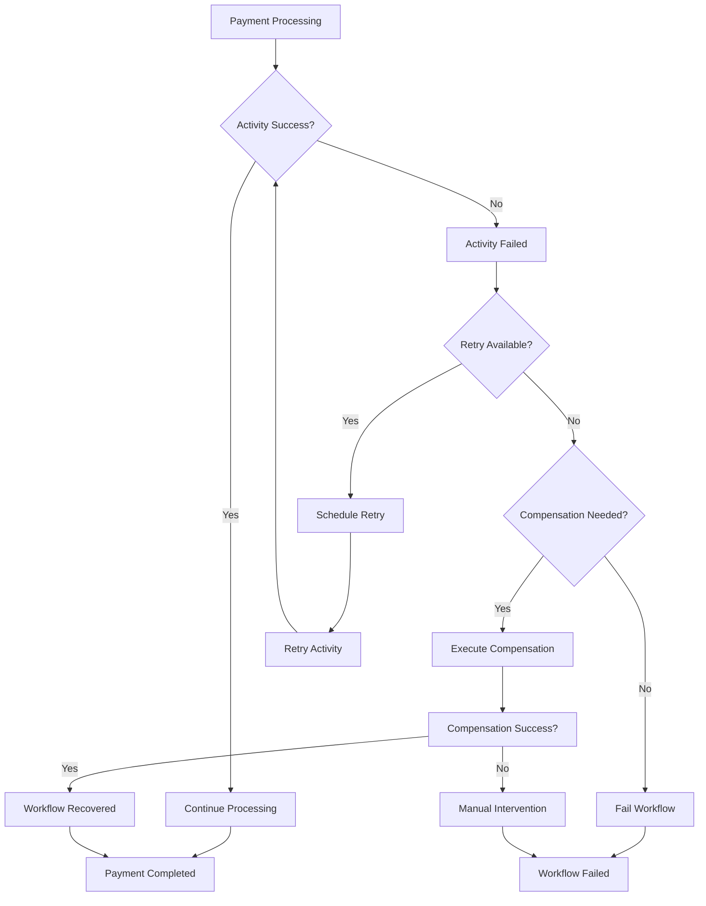

# Temporal & Payment Flow Interaction Guide

## 🏗️ **Kiến Trúc Tổng Quan**

```
┌─────────────────┐    ┌──────────────────┐    ┌─────────────────┐
│   REST API      │    │   Temporal       │    │   Activities    │
│   (Spring)      │◄──►│   Workflow       │◄──►│   (Business     │
│                 │    │   Engine         │    │    Logic)       │
└─────────────────┘    └──────────────────┘    └─────────────────┘
         │                       │                       │
         ▼                       ▼                       ▼
┌─────────────────┐    ┌──────────────────┐    ┌─────────────────┐
│   Database      │    │   Persistence    │    │   External      │
│   (PostgreSQL)  │    │   (Cassandra)    │    │   Services      │
└─────────────────┘    └──────────────────┘    └─────────────────┘
```

---

## 🔄 **Luồng Tương Tác Chi Tiết**

### **Phase 1: Khởi Tạo Payment Schedule**



**Code tương tác:**
```java
// TemporalWorkflowService.java
@Transactional
public void createPaymentProcessingSchedule(String scheduleId, String cronSchedule) {
    // 1. Validate & prepare
    if (scheduleRepo.existsByScheduleIdAndStatus(scheduleId, ScheduleStatus.ACTIVE)) {
        throw new IllegalStateException("Schedule already exists");
    }

    // 2. Create Temporal schedule
    ScheduleActionStartWorkflow action = ScheduleActionStartWorkflow.newBuilder()
        .setWorkflowType(PaymentMonitorWorkflow.class)  // ← Workflow class
        .setArguments("BANKING_SYSTEM", 0)             // ← Workflow args
        .build();

    Schedule schedule = Schedule.newBuilder()
        .setAction(action)
        .setSpec(ScheduleSpec.newBuilder()
            .setCronExpressions(List.of(cronSchedule))  // ← Cron trigger
            .build())
        .build();

    // 3. Register with Temporal
    scheduleClient.createSchedule(scheduleId, schedule, ScheduleOptions.newBuilder().build());

    // 4. Persist metadata
    saveScheduleEntity(scheduleId, cronSchedule, "PaymentMonitorWorkflow", "GENERAL_QUEUE", null);
}
```

---

### **Phase 2: Trigger & Workflow Execution**



---

### **Phase 3: Activity Execution Model**



**Activity Stub Creation:**
```java
// PaymentWorkflowImpl.java
public PaymentWorkflowImpl() {
    // Different retry policies for different operations
    ActivityOptions validationOptions = ActivityOptions.newBuilder()
        .setStartToCloseTimeout(Duration.ofMinutes(2))
        .setRetryOptions(RetryOptions.newBuilder()
            .setMaximumAttempts(2)  // Validation: minimal retries
            .build())
        .build();

    ActivityOptions executionOptions = ActivityOptions.newBuilder()
        .setStartToCloseTimeout(Duration.ofMinutes(5))
        .setRetryOptions(RetryOptions.newBuilder()
            .setMaximumAttempts(3)  // Execution: higher retries
            .setInitialInterval(Duration.ofSeconds(2))
            .build())
        .build();

    // Create activity stubs
    this.paymentValidation = Workflow.newActivityStub(PaymentValidationActivity.class, validationOptions);
    this.paymentExecution = Workflow.newActivityStub(PaymentExecutionActivity.class, executionOptions);
}
```

---

### **Phase 4: Signal & Query Mechanism**



**Signal Implementation:**
```java
// PaymentMonitorWorkflow.java (Interface)
@WorkflowInterface
public interface PaymentMonitorWorkflow {
    @WorkflowMethod
    void monitorPayments(String accountId, int iterationCount);

    @SignalMethod
    void triggerPaymentCheck(String paymentBatchId);  // ← Signal method

    @SignalMethod
    void updateStatus(String status);
}

// PaymentMonitorWorkflowImpl.java (Implementation)
@Override
public void triggerPaymentCheck(String paymentBatchId) {
    this.pendingPaymentBatchId = paymentBatchId;  // ← Just set flag
    this.eventCount++;
    log.info("Payment check triggered for batch: {}", paymentBatchId);
}
```

---

### **Phase 5: Persistence & Recovery**



**Persistence Details:**
```java
// Workflow state automatically persisted
private String currentStatus = "INITIALIZED";
private PaymentProgress progress = new PaymentProgress("INITIALIZED", 0, "INITIALIZED", "");
private String pendingPaymentBatchId = null;  // ← Workflow state variables

// Temporal automatically:
// 1. Persists state after each operation
// 2. Recovers state on worker restart
// 3. Maintains history for debugging
// 4. Handles versioning for code updates
```

---

### **Phase 6: Error Handling & Compensation**



**Compensation Implementation:**
```java
// PaymentWorkflowImpl.java
private void performCompensation(Exception originalException) {
    log.info("Initiating compensation saga");

    try {
        // Reverse account debit if charged
        if (originalException.getMessage().contains("execution")) {
            compensation.reverseAccountDebit(accountId, amount, originalException.getMessage());
        }

        // Cancel transaction
        compensation.cancelPaymentTransaction(transactionId, "PAYMENT_FAILED");

        // Log compensation event
        compensation.logCompensationEvent(paymentId, "FAILURE_COMPENSATION", originalException.getMessage());

    } catch (Exception compensationException) {
        log.error("Compensation failed, manual intervention required", compensationException);
    }
}
```

---

## 🔧 **Temporal Infrastructure Components**

### **1. Workflow Worker**
```java
// WorkerConfiguration.java
@Bean
public Worker generalWorker(WorkerFactory workerFactory) {
    Worker worker = workerFactory.newWorker("GENERAL_QUEUE");

    // Register workflow implementations
    worker.registerWorkflowImplementationTypes(
        PaymentWorkflowImpl.class,
        PaymentMonitorWorkflowImpl.class
    );

    // Register activity implementations
    worker.registerActivitiesImplementations(
        paymentValidationActivity,
        accountVerificationActivity,
        fraudDetectionActivity,
        paymentExecutionActivity
    );

    return worker;
}
```

### **2. Task Queues**
```java
// Different queues for different concerns
public static final String GENERAL_QUEUE = "GENERAL_QUEUE";  // ← Payment workflows here

// Queue-based routing allows:
// - Different worker pools
// - Priority-based processing
// - Geographic distribution
// - Load balancing
```

### **3. Activity Heartbeats**
```java
// Long-running activities report progress
@Override
public PaymentExecutionResult executePayment(String paymentId, String accountId, double amount, String currency) {
    // Report progress for long-running operations
    Activity.getExecutionContext().heartbeat("Connecting to scheduler processor...");
    Thread.sleep(1000);

    Activity.getExecutionContext().heartbeat("Processing scheduler...");
    Thread.sleep(2000);

    Activity.getExecutionContext().heartbeat("Confirming transaction...");
    Thread.sleep(1000);

    return new PaymentExecutionResult(true, "TXN-123", "3.0s", "COMPLETED", null, details);
}
```

---

## 📊 **Monitoring & Observability**

### **1. Workflow Metrics**
```java
// Temporal provides built-in metrics:
// - Workflow start/completion rates
// - Activity execution times
// - Queue depths
// - Error rates
// - Signal/query counts
```

### **2. Custom Monitoring**
```java
// PaymentWorkflowImpl.java
private void updateProgress(String step, int progressPercentage, String status) {
    this.currentStatus = status;
    this.progress = new PaymentProgress(step, progressPercentage, status, LocalDateTime.now().toString());

    // Custom metrics
    metrics.recordWorkflowProgress(paymentId, progressPercentage, step);
    log.info("Payment Progress: {}% - {} - {}", progressPercentage, step, status);
}
```

### **3. Query Methods for Monitoring**
```java
@QueryMethod
public String getStatus() {
    return currentStatus;  // ← Real-time status
}

@QueryMethod
public PaymentProgress getProgress() {
    return progress;  // ← Detailed progress info
}
```

---

## 🎯 **Reliability Guarantees**

### **Exactly-Once Execution**
- Temporal đảm bảo workflow methods execute exactly once
- Activity compensation handles partial failures
- Idempotency keys prevent duplicate processing

### **Fault Tolerance**
- Automatic worker failover
- State persistence across restarts
- Configurable retry policies
- Circuit breaker patterns

### **Scalability**
- Horizontal scaling of workers
- Queue-based load distribution
- Activity parallelism within workflows
- Multi-region deployment support

---

## 🚀 **Production Deployment Architecture**

```
┌─────────────────┐    ┌──────────────────┐
│   Load Balancer │    │   Temporal UI     │
│                 │    │   (Monitoring)    │
└─────────────────┘    └──────────────────┘
          │                       │
          ▼                       ▼
┌─────────────────┐    ┌──────────────────┐
│   API Gateway   │────│   Temporal       │
│   (Spring Boot) │    │   Server         │
└─────────────────┘    └──────────────────┘
          │                       │
          ▼                       ▼
┌─────────────────┐    ┌──────────────────┐
│   Workflow      │    │   Activity       │
│   Workers       │    │   Workers        │
│   (Payment)     │    │   (Business      │
└─────────────────┘    │    Logic)        │
                       └──────────────────┘
                               │
                               ▼
                    ┌──────────────────┐
                    │   External       │
                    │   Services       │
                    │   (Banks, APIs)  │
                    └──────────────────┘
```

---

## 🎉 **Kết Luận**

**Temporal + Payment Flow** tạo ra một hệ thống:

✅ **Reliable**: Exactly-once execution, automatic retries, compensation  
✅ **Scalable**: Horizontal scaling, queue-based distribution  
✅ **Observable**: Real-time monitoring, detailed logging  
✅ **Maintainable**: Clean separation, activity-based architecture  
✅ **Resilient**: Fault tolerance, circuit breakers, recovery  

**Payment processing giờ đây là enterprise-grade với Temporal orchestration!** 🚀💰
